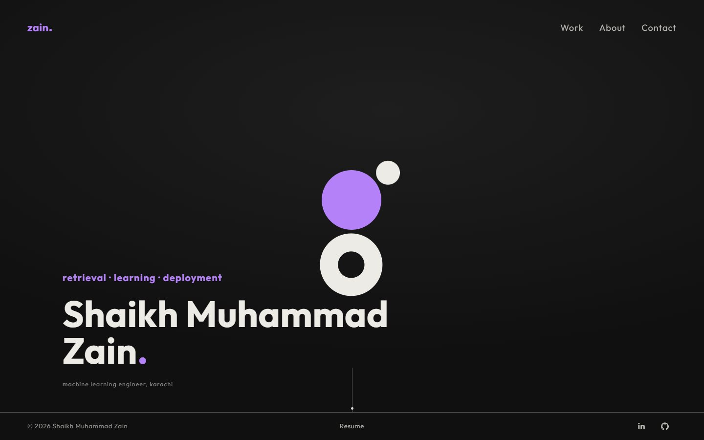
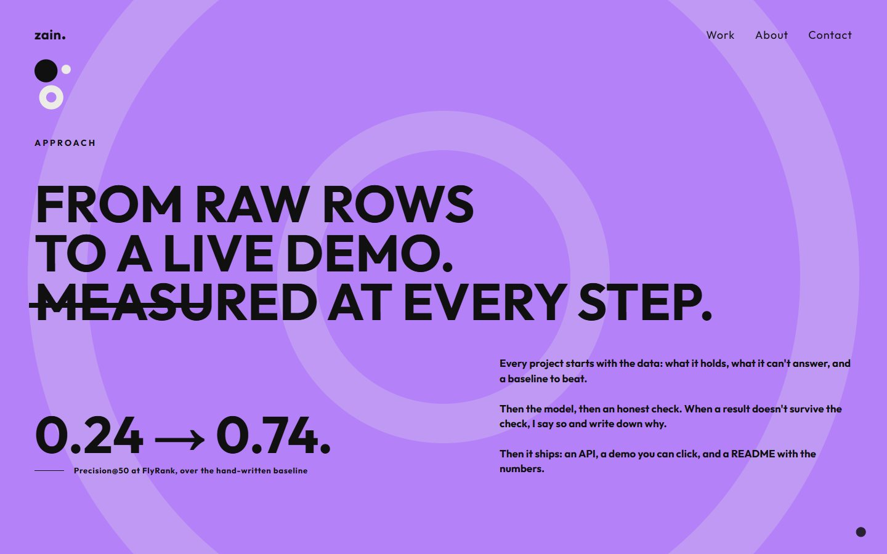
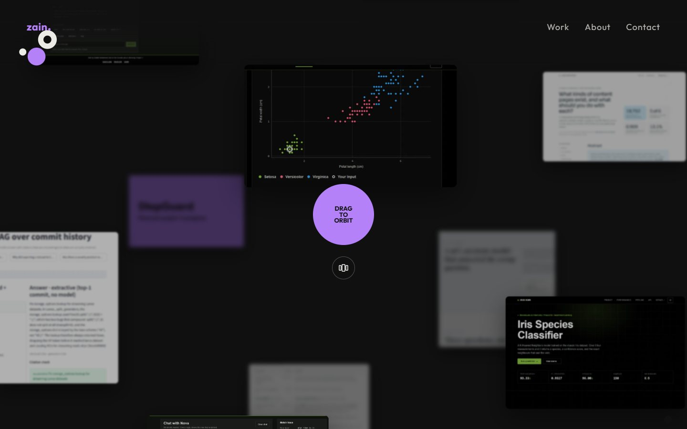
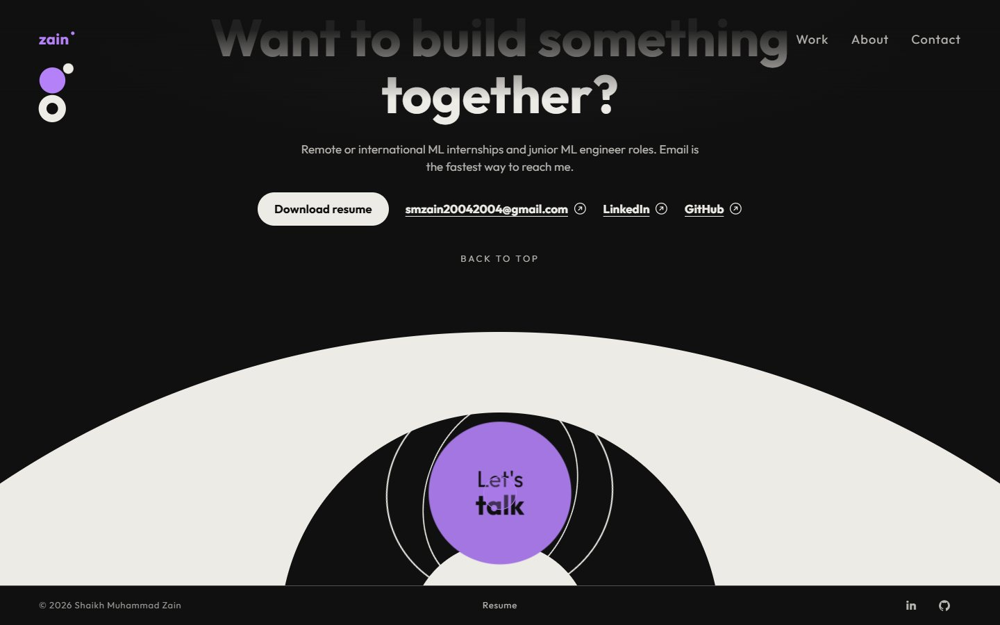
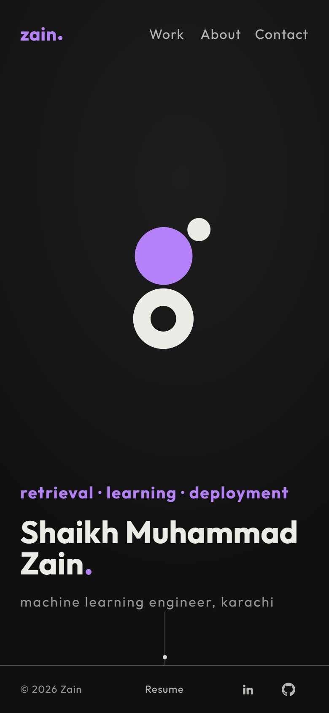

# Shaikh Muhammad Zain · Portfolio

Personal site of Shaikh Muhammad Zain, a final-year Computer Science (AI) student at NED University, Karachi, working on retrieval systems, supervised learning and the APIs around them.

**Live:** [shaikh-muhammad-zain.vercel.app](https://shaikh-muhammad-zain.vercel.app)



## What's on the site

| Section | What it shows |
|---|---|
| Hero | The name, a one-line claim and an orbiting mark. Clicking pulls the two satellites into elliptical orbits aimed at the click point, with live orbit guides. On scroll the mark flies to the top left and docks as the logo. |
| Approach | A purple disc grows out of the hero and fills the screen with a short statement of how I work, next to the Precision@50 result from FlyRank (0.24 → 0.74). |
| Work | The purple disc shrinks to reveal a 3D sphere of project screenshots that you can drag, hover and click, with a row view that auto-advances. Below it, an index of six projects with results, stack and links to the live demo, code or paper. |
| Skills | Rings for each skill area with the tools used in each. |
| Bio | Story, experience, education and certifications, with a pinned index that follows the scroll. |
| Contact | Email, LinkedIn, GitHub and a resume download. The "Let's talk" ball is tossed into place and opens an email. |

| Approach | Work |
|---|---|
|  |  |

| Contact | Mobile |
|---|---|
|  |  |

## Projects featured

| Project | Result | Links |
|---|---|---|
| EduPulse, student performance intelligence | At-risk ROC-AUC 0.742 (CV), math-score R² 0.882 on hold-out | [Live](https://edupulse-ml.vercel.app) · [Code](https://github.com/ZainDev04/edupulse) |
| FlyRank ML internship | Precision@50 from 0.24 to 0.74; 30k to 79M rows with DuckDB | [Paper](https://zaindev04.github.io/Flyrank-ML-Internship/) · [Code](https://github.com/ZainDev04/Flyrank-ML-Internship) |
| Semantic search over Git history | Right commit at rank 1 for 20 of 22 questions (dense) vs 17 (BM25) | [Code](https://github.com/ZainDev04/Semantic-Search-Engine-RAG-FAISS) |
| Nova, rule-based chatbot | 34 intents, five matching tiers, every reply traceable | [Live](https://nova-rule-based-chatbot.vercel.app) · [Code](https://github.com/ZainDev04/Rule-based-chatbot) |
| Iris species classifier | 96.0% five-fold cross-validated accuracy | [Live](https://iris-knn.vercel.app) · [Code](https://github.com/ZainDev04/iris-classifier) |
| StepGuard, final year project | Hallucination detection for LangGraph agents, in progress | |

## Built with

- [Next.js 16](https://nextjs.org) (App Router, the page is prerendered as static HTML) and React 19
- TypeScript and CSS Modules, with design tokens as CSS custom properties
- [GSAP](https://gsap.com) with ScrollTrigger for the scroll scenes, [Lenis](https://lenis.darkroom.engineering) for smooth scrolling, [Motion](https://motion.dev) for the cursor
- Hand-written physics for the hero orbit and a CSS 3D sphere for the project gallery, no WebGL
- Outfit and JetBrains Mono through `next/font`
- Deployed on [Vercel](https://vercel.com); every push to `main` goes live

## Details

- **Responsive** from 320px (iPhone SE) up. Phones get a swipe carousel in place of the 3D sphere, and the text in the Approach scene scales down on very short screens so nothing is cut off.
- **Accessible:** keyboard focus rings, a skip link, 44px minimum tap targets, text contrast of at least 4.5:1 in every colour state, and a full reduced-motion mode where every section is still readable.
- **Colour cycle:** a click anywhere changes the accent from purple to blue to mustard; every accent has a darker partner for text on light backgrounds.
- **Search and sharing:** page metadata, an Open Graph image generated at build time, `sitemap.xml`, `robots.txt`, JSON-LD person data and a custom 404 page.

## Project structure

```
src/
  app/            layout, page, metadata routes, 404
  components/
    hero/         hero, orbit physics and docking, footer strip
    manifest/     Approach scene (scroll-driven disc and sphere)
    orbit/        3D project sphere and row view
    work/         project index and mobile carousel
    skills/  bio/  quote/  contact/
    ui/           cursor, arrow links
  content/
    portfolio.ts  every fact on the site: projects, experience, education, certifications
  lib/            GSAP setup, media queries, click handling, site URL
public/
  work/           project screenshots
  Shaikh-Muhammad-Zain-Resume.pdf
```

To change what the site says, edit `src/content/portfolio.ts`. Colours, spacing and type sizes live in `src/app/globals.css`.

## Running it locally

Requires Node.js 20.9 or newer.

```bash
git clone https://github.com/ZainDev04/portfolio.git
cd portfolio
npm install
npm run dev
```

Then open [localhost:3000](http://localhost:3000).

| Command | What it does |
|---|---|
| `npm run dev` | Development server with hot reload |
| `npm run build` | Production build |
| `npm run start` | Serve the production build |
| `npm run lint` | ESLint |

Set `NEXT_PUBLIC_SITE_URL` if the site moves to a custom domain; it is used for canonical links, the sitemap and social previews.

## Contact

- Email: [smzain20042004@gmail.com](mailto:smzain20042004@gmail.com)
- LinkedIn: [shaikh-muhammad-zain](https://www.linkedin.com/in/shaikh-muhammad-zain/)
- GitHub: [ZainDev04](https://github.com/ZainDev04)

© 2026 Shaikh Muhammad Zain. All rights reserved.
